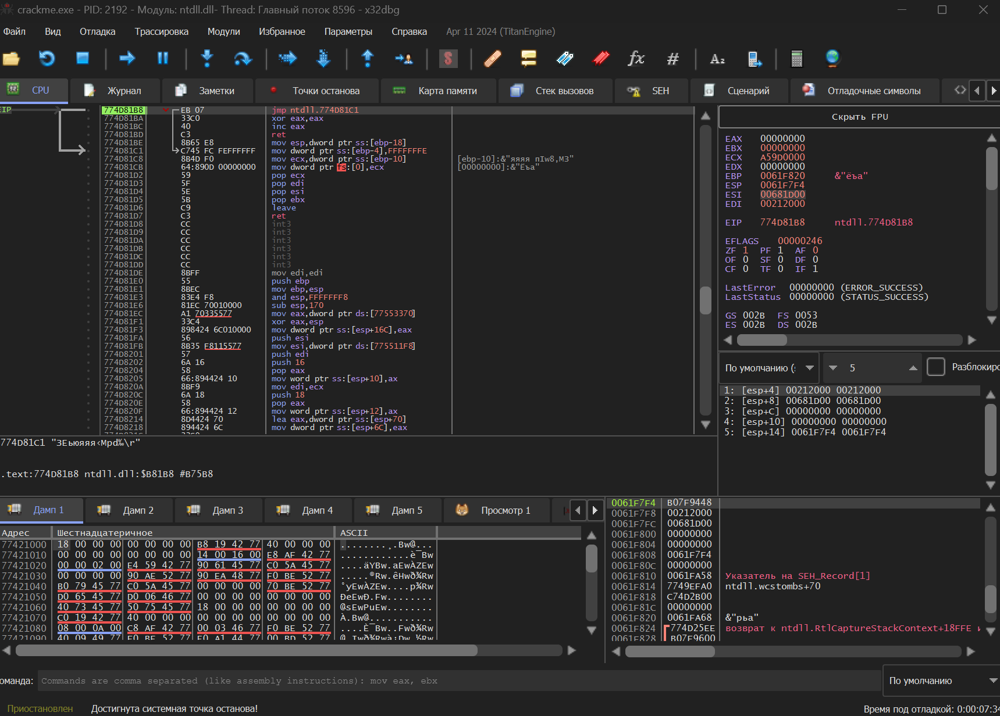
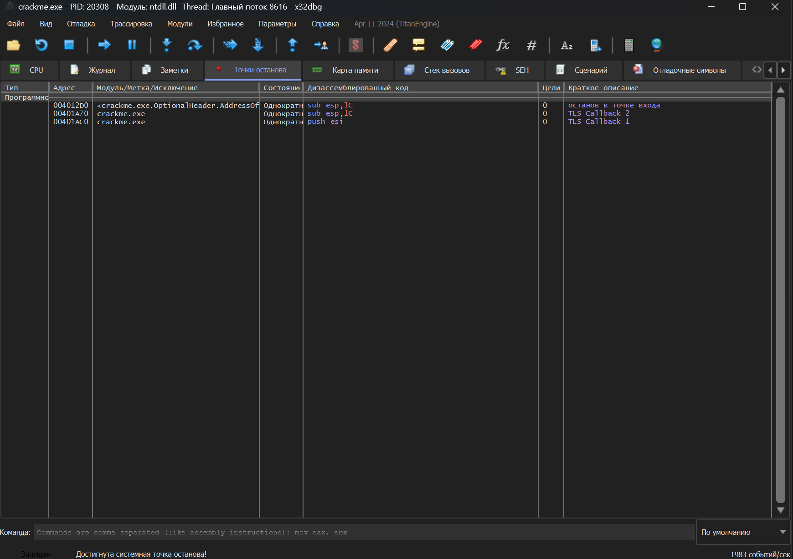
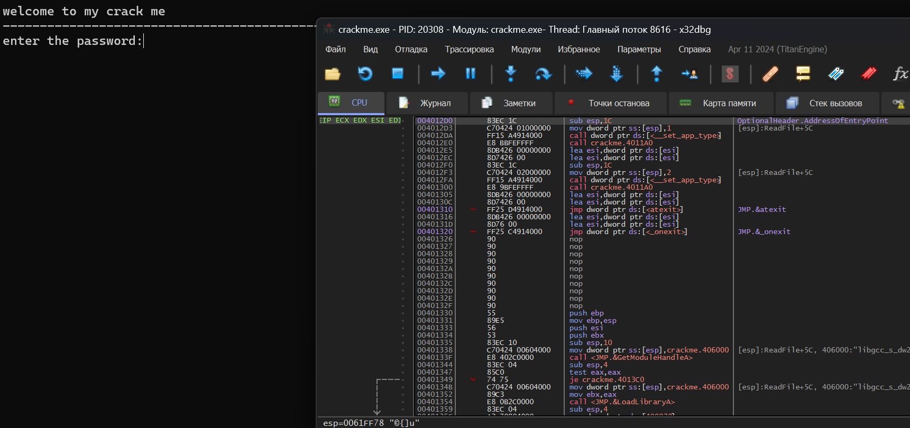
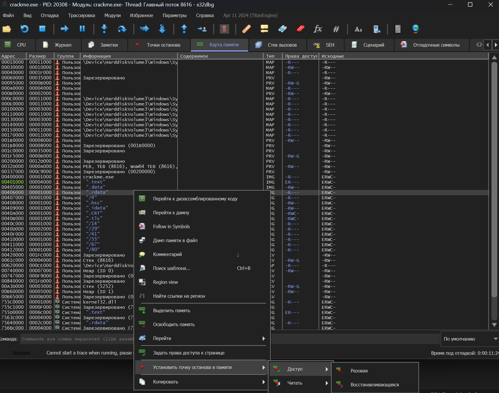
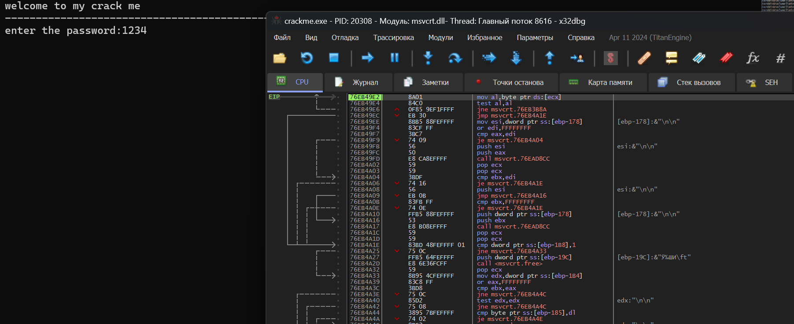
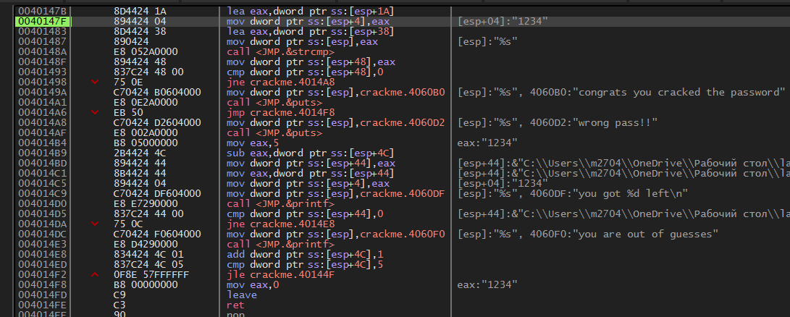
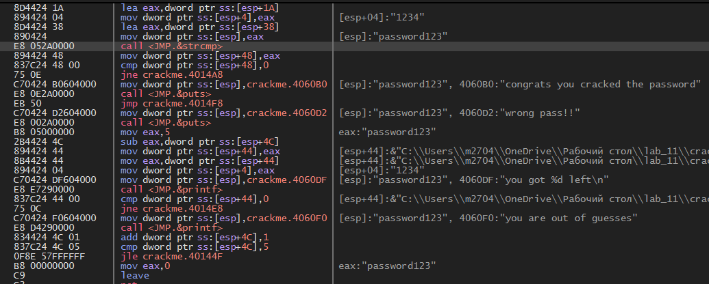
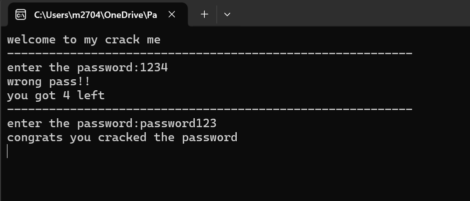

# Лабораторная работа №11
### Задание
С помощью x64dbg, IDA Freeware или других дизассемблеров/отладчиков определить пароль, необходимый для получения сообщения "congrats you cracked the password" в прикреплённой программе
### Ход выполнения
Для данной лабораторной работы я использовал средство отладки программы x32dbg.

Первый шаг запустить программу через отладчик:

Второй шаг это пройтись по автоматически созданным точкам останова(F9):

Достигнув момента ввода пароля, необходимо поставить точку останова по вызову для read-only части памяти:

Теперь вводим любой пароль и следим за поведением программы.

С этого момента необходимо делать шаг с обходом(F8), чтобы найти момент сравнения нашего пароля с истиным.

Тут уже видно, что происходит сравнение со строкой "password123", после чего выполняется переход к той или иной части кода.
Проверем же найденное значение:

### Ответ
Пароль: password123